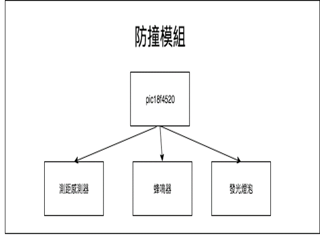
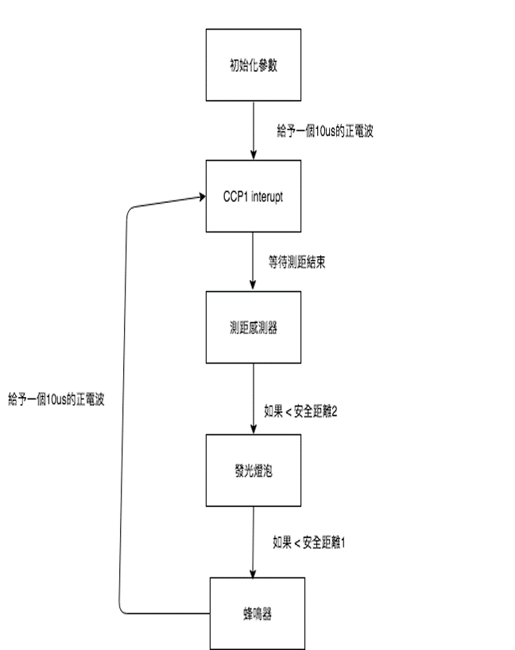
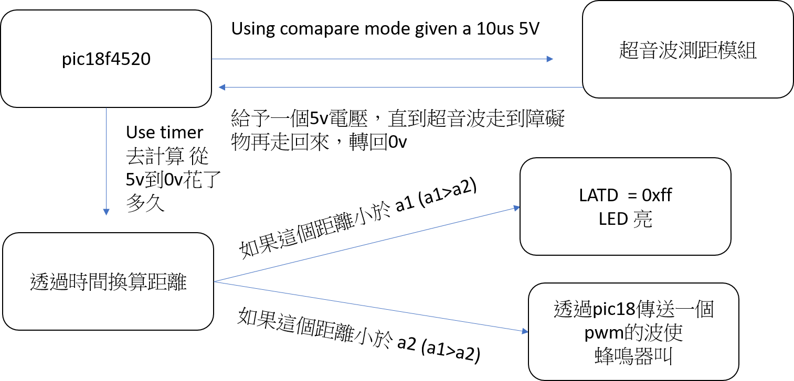
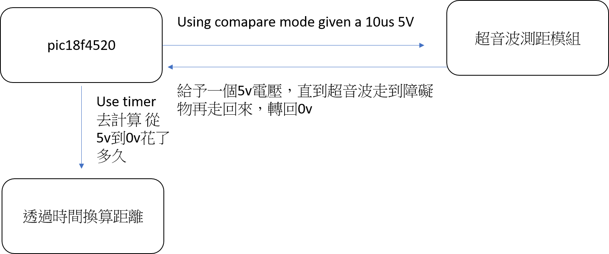

# 腳踏車防撞模組
## bike-anti-collision-module
### 目標
有些人腳踏車在夜晚的時候會在身後放一個腳踏車夜晚的照明燈，以維持避免與後方來車擦撞，但往往後面的車輛並不知道是否與自己的腳踏車有安全的距離。
因此我設計了一個模組他能夠偵測到與後面車輛不適當距離時以蜂鳴器與警示燈警告它。

### 作品架構圖

### 流程圖

### 蜂鳴器

### 超音波

